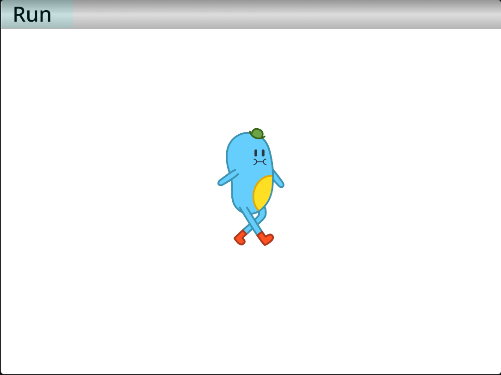

# Puberty
Runtime de scratch jr que corre en scratch, esto es solo una prueba de concepto

## Bloques no implementados
- Bucles, bloques de espera y realmente cualquier bloque que corre a varios frames
  - Solo el bucle "Repetir indefinidamente" esta soportado 
- Sonidos de usuario
- Paginas (funciona pero no muy bien)
### Bloques implementados
- Mover a la derecha/izquierda [x]
- Reproducir pop
- Subir [x]
- Bajar [x]
- Girar a la derecha/izquierda [x]
- Ir al inicio
- Decir [x]
- Crecer/disminuir [x]
- Mostrar/esconder
- Restablecer tamaño
# Consideraciones
Debido a que es muy temprano hay que tener algunas medidas en cuenta
 - Los scripts solo correran si estan en "Ta" (medida temporal)
 - Pueden haber muchos bugs (reportalos en issues si es el caso)
- Si tienes un sprite personalizado, todos los objetos tendran ese sprite, incluso si no tienen dicho sprite
- Los sprites oficiales de Scratch Jr no cargaran
## Depuracion
Hay algunas teclas de depuracion 

`1` Muestra variables del runtime 
`2` Oculta las variables 
`3` Guarda el log del runtime en `log.txt`
# Creditos
- [Scratch Everywhere!](https://github.com/ScratchEverywhere/ScratchEverywhere) por inspirar este proyecto 
- El equipo MIT por hacer Scratch Jr 
- Mistium por hacer [MistWarp](https://warp.mistium.com/)
- Las extensiones de TurboWarp por carrear esta cosa
