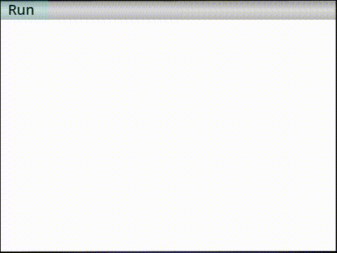

# Puberty
A Scratch Jr runtime that runs in Scratch. This is just a proof of concept.

## Unimplemented Blocks
(if your block is not here, it is implemented)
- Loops, wait blocks, and really any block that runs across multiple frames
  - Only the "forever" loop is supported
- User sounds
- Pages (works but not very well)

# Considerations

Because it's very early, there are a few things to keep in mind:
- Scripts will only run if they are in "Ta" (temporary measure)
- There may be many bugs (report them in issues if you find them)
- If you have a custom sprite, all objects They will have that sprite, even if they don't have said sprite.
- Official Scratch Jr sprites and backgrounds will not load.
## Debugging
There are some debug keys 

`1` Shows runtime variables 
`2` Hides variables 
`3` Saves the runtime log to `log.txt`
# Credits
- [Scratch Everywhere!](https://github.com/ScratchEverywhere/ScratchEverywhere) for inspiring this project 
- The MIT team for making Scratch Jr 
- Mistium for making [MistWarp](https://warp.mistium.com/)
- TurboWarp extensions for carrying this thing
